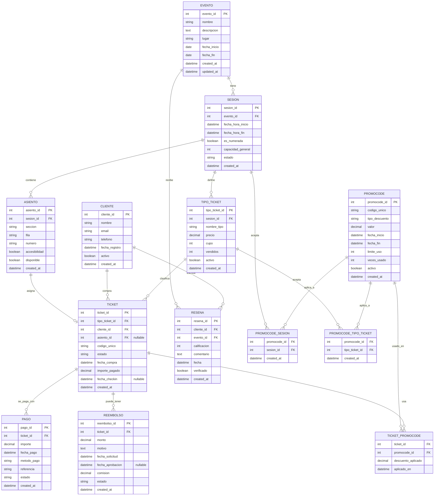

# Plataforma de Eventos y Entradas (Eventos → Sesiones → Tickets)

1. El sistema gestiona **Eventos** (con nombre, descripción, lugar, fechas).
2. Un Evento puede tener **múltiples Sesiones** (fechas/horas distintas en mismo evento).
3. Cada Sesión tiene **Tipos de Ticket** (General, VIP, Early-bird) con precio y cantidad limitada por tipo.
4. **Asiento opcional**: algunas sesiones son numeradas (asientos), otras son libres (capacidad general).
5. Un **Cliente** compra uno o varios **Tickets** para una sesión — cada ticket es único y puede cambiar de estado (reservado, pagado, cancelado, usado).
6. Soportar **descuentos/promocodes** aplicables a sesiones específicas o tipo de ticket.
7. Registrar **Check-in** cuando el asistente usa el ticket; no se puede volver a usar.
8. Posibilidad de **reembolso parcial** con reglas (plazo para devolución, comisión).
9. **Reseñas** del evento por asistentes después de la sesión.
10. Necesidad de reportes: ocupación por sesión, ingresos por evento, tickets vendidos por tipo.

## Identificación de entidades

**Entidad EVENTO**

- id_evento (PK)
- nombre
- descripcion
- lugar
- fecha_inicio
- fecha_fin

**Entidad SESION**

- id_sesion (PK)
- id_evento (FK)
- fecha
- hora
- capacidad (opcional si no numerada)

**Entidad TIPO_TICKET**

- id_tipo_ticket (PK)
- id_sesion (FK)
- nombre_tipo (General, VIP, etc.)
- precio
- cantidad_max

**Entidad ASIENTO** (solo si numerada)

- id_asiento (PK)
- id_sesion (FK)
- fila
- numero
- estado (disponible, ocupado)

**Entidad CLIENTE**

- id_cliente (PK)
- nombre
- email
- telefono

**Entidad TICKET**

- id_ticket (PK)
- id_cliente (FK)
- id_sesion (FK)
- id_tipo_ticket (FK)
- id_asiento (FK, nullable si no numerada)
- estado (reservado, pagado, cancelado, usado)

**Entidad PAGO**

- id_pago (PK)
- id_ticket (FK)
- monto_pagado
- fecha_pago
- metodo_pago
- estado_pago (completado, reembolsado parcial, reembolsado total)

**Entidad REEMBOLSO**

- id_reembolso (PK)
- id_pago (FK)
- monto_devuelto
- fecha_reembolso
- motivo
- porcentaje_comision

**Entidad DESCUENTO**

- id_descuento (PK)
- codigo
- porcentaje
- valido_desde
- valido_hasta

**Entidad CHECKIN**

- id_checkin (PK)
- id_ticket (FK)
- fecha_checkin
- validado_por (usuario del staff)

**Entidad RESEÑA**

- id_resena (PK)
- id_cliente (FK)
- id_evento (FK)
- calificacion
- comentario
- fecha_resena

## Identificación de relaciones

### Relación Evento–Sesión

- **Evento → Sesión:** _"Evento tiene sesiones"_ (1:N)
- **Sesión → Evento:** _"Sesión pertenece a un evento"_ (N:1, pero cada sesión solo a 1 evento)

### Relación Sesión–TipoTicket

- **Sesión → TipoTicket:** _"Sesión ofrece tipos de ticket"_ (1:N)
- **TipoTicket → Sesión:** _"Tipo de ticket corresponde a una sesión"_ (N:1)

### Relación Sesión–Asiento

- **Sesión → Asiento:** _"Sesión contiene asientos"_ (1:N, opcional si numerada)
- **Asiento → Sesión:** _"Asiento pertenece a una sesión"_ (N:1)

### Relación Sesión–Ticket

- **Sesión → Ticket:** _"Sesión genera tickets"_ (1:N)
- **Ticket → Sesión:** _"Ticket corresponde a una sesión"_ (N:1)

### Relación Cliente–Ticket

- **Cliente → Ticket:** _"Cliente compra tickets"_ (1:N)
- **Ticket → Cliente:** _"Ticket fue comprado por cliente"_ (N:1)

### Relación Ticket–Pago

- **Ticket → Pago:** _"Ticket se paga mediante pago"_ (1:1)
- **Pago → Ticket:** _"Pago pertenece a un ticket"_ (1:1)

### Relación Pago–Reembolso

- **Pago → Reembolso:** _"Pago genera reembolsos"_ (1:N, pueden existir reembolsos parciales múltiples)
- **Reembolso → Pago:** _"Reembolso corresponde a un pago"_ (N:1)

### Relación Ticket–Descuento

- **Ticket → Descuento:** _"Ticket usa descuento"_ (N:1, opcional)
- **Descuento → Ticket:** _"Descuento se aplica a tickets"_ (1:N)

### Relación Ticket–Checkin

- **Ticket → Checkin:** _"Ticket genera check-in"_ (1:1, opcional si el cliente no asistió)
- **Checkin → Ticket:** _"Check-in valida ticket"_ (1:1)

### Relación Cliente–Reseña

- **Cliente → Reseña:** _"Cliente escribe reseña"_ (1:N)
- **Reseña → Cliente:** _"Reseña fue escrita por cliente"_ (N:1)

### Relación Evento–Reseña

- **Evento → Reseña:** _"Evento recibe reseñas"_ (1:N)
- **Reseña → Evento:** _"Reseña corresponde a evento"_ (N:1)

## 1. Lista definida de requisitos

1. El sistema gestiona **Eventos** con entidad EVENTO que incluye nombre, descripción, lugar y fechas de inicio/fin.
2. Cada **Evento** puede tener **múltiples Sesiones** mediante relación 1:N, cada sesión con fechas/horas específicas.
3. En cada **Sesión** se definen **Tipos de Ticket** con entidad TIPO_TICKET que maneja precio y cupo por categoría.
4. Sistema flexible de asientos con campo `es_numerada` y entidad ASIENTO opcional para sesiones numeradas.
5. **Clientes** compran **Tickets** únicos con códigos QR y estados dinámicos (reservado→pagado→usado/cancelado).
6. **Pagos** registran liquidaciones con soporte para múltiples pagos por ticket (cuotas/parciales).
7. **Promocodes** aplicables a sesiones específicas o tipos de ticket mediante tablas intermedias.
8. **Reembolsos** totales/parciales con reglas de negocio (plazos, comisiones, estados de aprobación).
9. **Reseñas** verificadas post-evento con validación de asistencia mediante check-in.
10. Sistema de **reportes** integral con consultas SQL para ocupación, ingresos y análisis por tipo.

---

## 2. Identificación de Entidades

- **Evento**
- **Sesion**
- **TipoTicket**
- **Ticket**
- **Cliente**
- **Asiento**
- **Promocode**
- **Pago**
- **Reembolso**
- **Resena**

---

## 3. Identificación de Relaciones y Cardinalidades

- Un **Evento (1)** tiene **(1..N) Sesiones**.
- Una **Sesion (1)** define **(1..N) Tipos de Ticket**.
- Una **Sesion (1)** vende **(0..N) Tickets**.
- Un **TipoTicket (1)** clasifica **(0..N) Tickets**.
- Un **Cliente (1)** posee **(0..N) Tickets**.
- Una **Sesion (1)** ofrece **(0..N) Asientos** (si es numerada).
- Un **Asiento (1)** puede estar asignado a **(0..1) Ticket**.
- Un **Promocode (1)** se aplica a **(0..N) Sesiones**.
- Un **Promocode (1)** se aplica a **(0..N) Tipos de Ticket**.
- Un **Ticket (0..N)** puede usar **(0..N) Promocodes** → relación **N:M**.
- Un **Ticket (1)** se paga con **(1..N) Pagos**.
- Un **Ticket (1)** puede tener **(0..N) Reembolsos**.
- Un **Cliente (1)** escribe **(0..N) Reseñas**.
- Un **Evento (1)** recibe **(0..N) Reseñas**.

---

## 4. Identificación de Atributos

**Evento**

- evento_id
- nombre
- descripcion
- lugar
- fecha_inicio
- fecha_fin

**Sesion**

- sesion_id
- evento_id
- fecha_hora_inicio
- fecha_hora_fin
- capacidad_general
- estado

**TipoTicket**

- tipo_ticket_id
- sesion_id
- nombre_tipo (General, VIP, Early-bird)
- precio
- cupo
- vendidos

**Ticket**

- ticket_id
- tipo_ticket_id
- cliente_id
- asiento_id
- codigo_unico (QR o de barras)
- estado (reservado, pagado, cancelado, usado)
- fecha_compra
- importe_pagado
- fecha_checkin

**Cliente**

- cliente_id
- nombre
- email
- telefono
- fecha_registro

**Asiento**

- asiento_id
- sesion_id
- seccion
- fila
- numero
- accesibilidad

**Promocode**

- promocode_id
- codigo_unico
- tipo_descuento (porcentaje o monto fijo)
- valor
- fecha_inicio
- fecha_fin
- limite_uso
- veces_usado
- activo

**Pago**

- pago_id
- ticket_id
- importe
- fecha_pago
- metodo_pago (tarjeta, PayPal, etc.)
- referencia
- estado

**Reembolso**

- reembolso_id
- ticket_id
- monto
- fecha_solicitud
- fecha_aprobacion
- comision
- estado (solicitado, aprobado, rechazado, abonado)

**Resena**

- calificacion
- comentario
- fecha

---

## 5. Jerarquías / Generalizaciones

- **TICKET** puede implementar especialización según TIPO_TICKET (TicketVIP, TicketGeneral, TicketEarlyBird) con atributos específicos.
- **CLIENTE** puede generalizarse a USUARIO con roles (Cliente, Organizador, Administrador) para escalabilidad futura.
- **SESION** tiene composición opcional con ASIENTO solo cuando es_numerada = true.
- **PROMOCODE** puede especializarse en PromocodeSesion y PromocodeTipoTicket según aplicabilidad.

---

## 6. Diagrama de Chen en Mermaid

