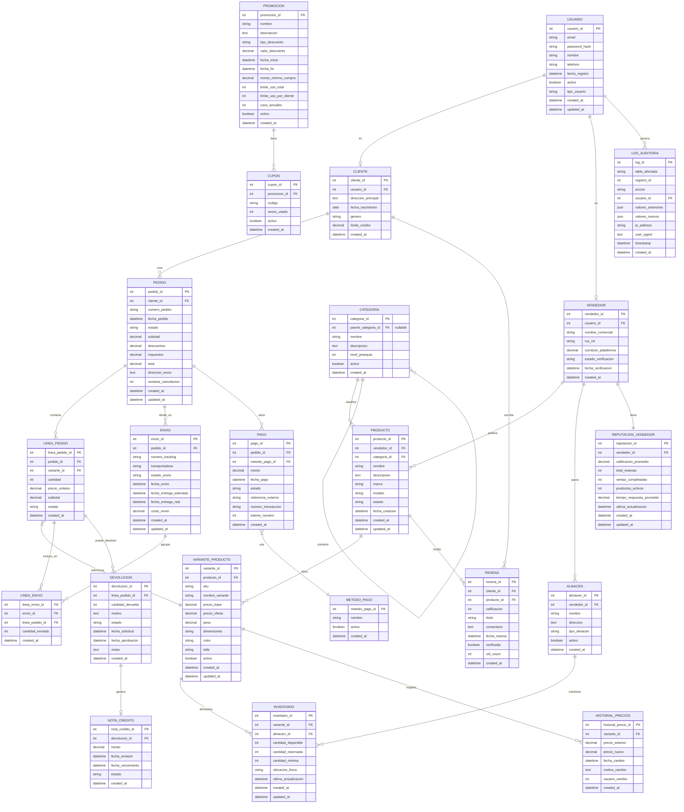

## Marketplace + Logística (ventas, proveedores, stock, envíos, devoluciones, promociones)

1. La plataforma es un **marketplace** donde **Vendedores** ponen a la venta **Productos** y **Clientes** compran.
2. Un **Usuario** puede ser ​**Cliente**​, **Vendedor** o ambos (modelo con subtipos).
3. Los **Productos** tienen **variantes** (p. ej. talla, color) y pertenecen a una **Categoría** jerárquica (categoría → subcategoría → …).
4. Cada **Producto/Variante** mantiene **inventario** por **Almacén** (multi-warehouse).
5. Los **Vendedores** pueden tener **múltiples almacenes** u ofrecer “dropshipping” (stock en proveedor).
6. Un **Pedido** es creado por un Cliente y puede contener múltiples **Líneas de pedido (order items)** (cada item apunta a una variante de producto).
7. Un **Pedido** puede dividirse en ​**varios envíos (Shipments)**​; un envío agrupa uno o varios items y tiene ​**estado de envío**​.
8. El sistema registra **Pagos** (posibles múltiples intentos, reembolsos parciales) y ​**Método de pago**​.
9. Existencia de ​**Devoluciones**​: se registra devolución por línea, motivo, estado y posible **nota de crédito** o reembolso.
10. **Promociones / Cupones** aplicables por producto, categoría, vendedor o pedido (fechas de validez, condiciones mínimas).
11. **Reseñas** y **Valoraciones** de producto por clientes, y ​**reputación de vendedor**​.
12. **Historial de precios** (price history) para cada variante — interesa para auditoría y análisis.
13. **Reglas de negocio** importantes: reserva de stock cuando se crea pedido; cancelación en ventana X minutos; bloqueo de envío si stock insuficiente; máximos de compra por cliente por producto (ej.: 5 unidades).
14. Registro de ​**logs de auditoría**​: quién creó/actualizó pedidos, cambios de stock críticos.
15. **Reportes** frecuentes: ventas por día/region/vendedor, productos sin stock, pedidos pendientes de pago.

## 1. Lista predefinida de requisitos

1. Marketplace con **Vendedores** que publican **Productos** y **Clientes** que compran mediante entidades separadas con relaciones específicas.
2. **Usuarios** con jerarquía ISA implementada con USUARIO base y subtipos CLIENTE/VENDEDOR con roles múltiples.
3. **Productos** con **Variantes** y **Categorías** jerárquicas mediante auto-referencia con parent_categoria_id.
4. **Inventario** multi-almacén con entidad INVENTARIO que relaciona VARIANTE_PRODUCTO con ALMACEN.
5. **Vendedores** con múltiples **Almacenes** y soporte dropshipping mediante campo tipo_almacen.
6. **Pedidos** con múltiples **Líneas de Pedido** que referencian variantes específicas de productos.
7. **Envíos** que agrupan líneas de pedido con estados independientes y tracking de entrega.
8. Sistema de **Pagos** con múltiples intentos, métodos de pago y soporte para reembolsos parciales.
9. **Devoluciones** por línea con motivos, estados y generación de notas de crédito automáticas.
10. **Promociones/Cupones** flexibles aplicables a productos, categorías, vendedores o pedidos completos.
11. Sistema de **Reseñas** de productos y **Reputación** de vendedores con métricas agregadas.
12. **Historial de precios** por variante con timestamp para auditoría y análisis de tendencias.
13. **Reglas de negocio** implementadas mediante triggers y constraints: reserva de stock, límites por cliente, ventanas de cancelación.
14. **Logs de auditoría** completos con tracking de cambios críticos en pedidos e inventario.
15. **Reportes** integrales con vistas materializadas para ventas, stock y análisis por dimensiones múltiples.

---

## 2. Identificación de Entidades

- **Usuario**
- **Cliente**
- **Vendedor**
- **Producto**
- **VarianteProducto**
- **Categoria**
- **Almacen**
- **Inventario**
- **Pedido**
- **LineaPedido**
- **Envio**
- **LineaEnvio**
- **Pago**
- **MetodoPago**
- **Devolucion**
- **NotaCredito**
- **Promocion**
- **Cupon**
- **Resena**
- **ReputacionVendedor**
- **HistorialPrecios**
- **LogAuditoria**

---

## 3. Identificación de Relaciones y Cardinalidades

- Un **Usuario (1)** puede ser **(0..1) Cliente** y/o **(0..1) Vendedor** → jerarquía ISA.
- Un **Vendedor (1)** publica **(0..N) Productos**.
- Un **Producto (1)** tiene **(1..N) Variantes**.
- Una **Categoria (1)** puede tener **(0..N) Subcategorías** → auto-referencia.
- Un **Producto (1)** pertenece a **(1) Categoría**.
- Un **Vendedor (1)** opera **(1..N) Almacenes**.
- Un **Almacén (1)** mantiene **(0..N) Inventarios**.
- Una **VarianteProducto (1)** tiene **(0..N) Inventarios** (por almacén).
- Un **Cliente (1)** crea **(0..N) Pedidos**.
- Un **Pedido (1)** contiene **(1..N) Líneas de Pedido**.
- Una **LineaPedido (1)** referencia **(1) VarianteProducto**.
- Un **Pedido (1)** se divide en **(1..N) Envíos**.
- Un **Envío (1)** agrupa **(1..N) Líneas de Envío**.
- Una **LineaPedido (1)** se incluye en **(0..N) Líneas de Envío**.
- Un **Pedido (1)** tiene **(1..N) Pagos**.
- Un **Pago (1)** usa **(1) Método de Pago**.
- Una **LineaPedido (1)** puede tener **(0..N) Devoluciones**.
- Una **Devolución (1)** puede generar **(0..1) Nota de Crédito**.
- Una **Promoción (1)** se aplica a **(0..N) Productos/Categorías/Vendedores**.
- Un **Cliente (1)** escribe **(0..N) Reseñas**.
- Un **Producto (1)** recibe **(0..N) Reseñas**.
- Un **Vendedor (1)** tiene **(1) Reputación**.
- Una **VarianteProducto (1)** tiene **(0..N) Registros de Historial de Precios**.

---

## 4. Identificación de Atributos

**Usuario**

- usuario_id
- email
- password
- nombre
- telefono
- fecha_registro
- tipo_usuario (cliente/vendedor)

**Cliente**

- cliente_id
- usuario_id
- direccion_principal
- fecha_nacimiento
- genero
- limite_credito

**Vendedor**

- vendedor_id
- nombre_comercial
- comision_plataforma
- estado_verificacion
- fecha_verificacion

**Producto**

- producto_id
- vendedor_id
- categoria_id
- nombre
- descripcion
- marca
- modelo
- fecha_creacion

**VarianteProducto**

- variante_id
- producto_id
- nombre_variante
- precio_base
- precio_oferta
- caracterísitcas_producto

**Categoria**

- categoria_id
- nombre
- descripcion
- nivel_jerarquia

**Almacen**

- dirección
- capacidad

**Inventario**

- cantidad_disponible
- cantidad_reservada
- cantidad_minima
- ubicacion_fisica

**Pedido**

- pedido_id
- cliente_id
- numero_pedido
- fecha_pedido
- estado (pendiente/confirmado/enviado/entregado/cancelado)
- subtotal
- descuentos
- impuestos
- total
- direccion_envio

**LineaPedido**

- pedido_id
- variante_id
- cantidad
- precio_unitario
- subtotal
- estado (pendiente/confirmado/enviado/entregado/devuelto)

**Envio**

- pedido_id
- numero_tracking
- transportadora
- estado_envio (preparando/enviado/en_transito/entregado/devuelto)
- fecha_envio
- fecha_entrega_estimada
- fecha_entrega_real
- costo_envio

**LineaEnvio**

- cantidad_enviada

**Pago**

- pago_id (PK)
- pedido_id (FK)
- metodo_pago_id (FK)
- monto
- fecha_pago
- estado (pendiente/aprobado/rechazado/reembolsado)
- referencia_externa
- numero_transaccion
- intento_numero
- created_at

**MetodoPago**

- metodo_pago
- nombre (tarjeta_credito/paypal/transferencia/etc)
- importe
- fecha_pago

**Devolucion**

- devolucion_id
- linea_pedido_id
- cantidad_devuelta
- motivo
- estado (solicitada/aprobada/rechazada/procesada)
- fecha_solicitud
- fecha_aprobacion

**NotaCredito**

- monto
- fecha_emision
- estado (activa/usada/vencida)

**Promocion**

- nombre
- descripcion
- tipo_descuento (porcentaje/monto_fijo)
- valor_descuento
- fecha_inicio
- fecha_fin
- monto_minimo_compra
- limite_uso_total
- limite_uso_por_cliente
- usos_actuales

**Cupon**

- codigo
- veces_usado

**Resena**

- calificacion
- comentario
- fecha_resena

**ReputacionVendedor**

- calificacion_promedio
- total_resenas
- ventas_completadas

**HistorialPrecios**

- precio_anterior
- precio_nuevo
- fecha_cambio

**LogAuditoria**

- tipo_enitdad
- entidad_id
- acción
- usuario
- fecha

---

## 5. Jerarquías / Generalizaciones

- **USUARIO** es superclase con subclases **CLIENTE** y **VENDEDOR** (ISA overlapping - un usuario puede ser ambos).
- **CATEGORIA** implementa jerarquía recursiva mediante auto-referencia con parent_categoria_id.
- **PROMOCION** puede especializarse en PromocionProducto, PromocionCategoria, PromocionVendedor según aplicabilidad.
- **ALMACEN** puede tener subtipos AlmacenPropio y AlmacenDropshipping con atributos específicos.
- **PAGO** puede especializarse según método (PagoTarjeta, PagoPayPal, PagoTransferencia) con campos específicos.

---

## 6. Diagrama de Chen en Mermaid

